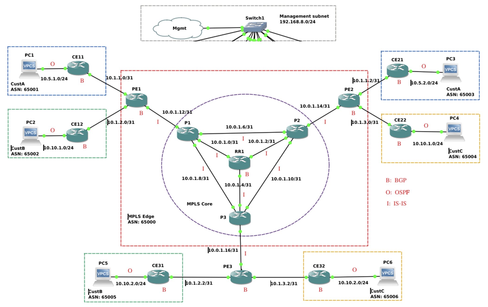

# Title: MPLS L3VPN in Service Provider Networks

## Abstract: 
This lecture will use a network emulation software, called GNS3, to build the MPLS VPN on the provider backbone networks. We will use OSPF, ISIS, BGP, VRF (virtual routing and forward), MPLS, and LDP on Cisco IOS. We would also discuss the pros and cons of the route leaks, and using it to route between two VRFs. If time permits, we will illustrate the application of route map for access control and route redistribution. We could also discuss the different options for Inter-AS MPLS VPN.

## Preparation: 
In order to better understand the material in the lecture, it is important for students to install GNS3 on their laptop (Intel based) and study the projects used in the lecture.  

Here are the steps:
  
1. To facilitate quick download without registration then [download from GNS3.com](https://www.gns3.com/software/download), you can choose to get the version 2.56.1 installers for your platform from [GNS3 github](https://github.com/GNS3/gns3-gui/releases/tag/v2.2.56.1) directly. 

2. Install [virtualbox](https://www.virtualbox.org/wiki/Downloads) on your laptop, then download [GNS3 VM for virtualbox](https://github.com/GNS3/gns3-gui/releases/download/v2.2.56.1/GNS3.VM.VirtualBox.2.2.56.1.zip) from GNS3 github.   Attention: this only works for Intel CPUs.

3. Download a Cisco 7200 IOS image file [c7200-advipservicesk9-mz.124-24.T8.image](https://drive.google.com/file/d/1L1LlgeaUuukX186Y7q3mrZcuGe3sn7Fq/view?usp=sharing) (limited available only on UMich campus - use UM VPN), and put it on your laptop folder:  ```$HOME/GNS3/images/IOS/```.  

4. Go to GNS3 UI's menu```[GNS3|Edit]->Preferences->Dynamips->Cisco IOS```, click the ```New``` button to add this image as "Run this IOS router on GNS3 VM". 

5. Download the related GNS3 project, [l3vpn.gns3project](https://drive.google.com/file/d/1abFk4kIUdPEiKl5KPDSphwJ_hv4nnOIl/view?usp=sharing) (~40MB, Limited to UMich campus access) and open it in GNS3.  The default username/password of routers are ```admin/admin```.  



### References: 

[1] Cisco, [Configure a basic MPLS VPN](https://www.cisco.com/c/en/us/support/docs/multiprotocol-label-switching-mpls/mpls/13733-mpls-vpn-basic.html).

[2] [Config OSPF](https://www.cisco.com/c/en/us/td/docs/ios-xml/ios/iproute_ospf/configuration/15-mt/iro-15-mt-book/iro-stub-router.html)

[3] [Understand RD and Route Targets](https://www.dasblinkenlichten.com/understanding-rts-and-rds/)

[4] [BGP Route Leaking](https://networklessons.com/bgp/bgp-route-leaking#:~:text=You%20need%20to%20configure%20your%20routers%20to%20have%20the%20correct,they%20establish%20a%20neighbor%20adjacency)

[5] [Route Leak MBGP Learned Routes between VRFs](https://community.cisco.com/t5/routing-and-sd-wan/route-leak-mbgp-learned-routes-between-vrf/td-p/3004310)

[6] [Inter AS MPLS VPN Option A B \& C](https://www.quisted.net/index.php/2025/09/12/inter-as-mpls-l3vpn-options-a-b-c/)